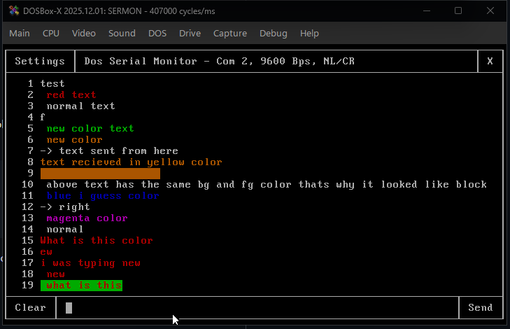
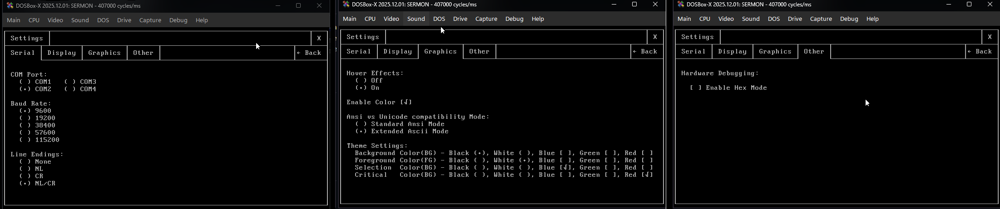
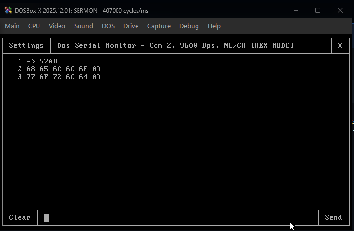

# DOS Serial Monitor
DOS Serial Monitor (SERMON.EXE) is a lightweight, hardware-accelerated MS-DOS serial port monitor designed for debugging a computer's serial port, which uses the RS232 Protocol. It supports translating ANSI and raw hex data. Built entirely from scratch in C++ with the help of Google Gemini for classic MS-DOS environments, it brings a modern, mouse-driven GUI experience into a pure 80x25 text-mode terminal. Like my previous projects, this was built to combine low-level hardware work with a highly polished, retro-futuristic aesthetic.

## Screenshots

Main Interface monitoring incoming serial data

Settings Menu with COM Port and Baud Rate configuration

Hex Mode for hardware level commnunication

# Features

Core Communications Engine
 - Direct hardware-level UART polling bypassing DOS interrupts for maximum speed and stability.
 - Support for standard COM ports (COM1 through COM4).
 - Adjustable baud rates ranging from 9600 up to 115200 bps.
 - Configurable line endings (None, NL, CR, NL/CR) for transmitting data.

Custom VRAM Interface
 - Custom graphical window manager running natively in standard DOS 80x25 text mode.
 - Highly optimized asynchronous UI engine: interacting with menus, clicking buttons, or dragging the scrollbar will not block the CPU or drop incoming serial bytes.
 - Full mouse support featuring a modern, dynamically resizing scrollbar with grab-and-drag functionality.
 - Shift-click text selection and highlighting in the command input buffer.
 - Toggleable ANSI and Extended ASCII drawing modes for maximum hardware compatibility.
 - Customizable UI themes with adjustable background, foreground, selection, and critical colors.

Hardware Debugging Tools
 - **HEX Mode:** Dynamically translates raw incoming bytes into formatted hex values. When typing in the input box, characters are sent down the serial line as raw hex.
 - **ANSI Color Parser:** Hardware-level parser that reads standard ANSI escape codes to instantly colorize incoming terminal text on the fly.
 - **Pseudo-Cursor:** Software-based block cursor for text input without relying on the BIOS hardware cursor.

## Supported Protocols
* **Serial Standard:** RS-232
* **Data Format:** 8 Data Bits, No Parity, 1 Stop Bit (8N1)

## System Requirements
Recommended 
For flawless 115200 baud streaming while interacting with the VRAM UI:
 - OS: MS-DOS 5.0+, FreeDOS, or modern emulators (DOSBox, DOSBox-X)
 - CPU: Intel 80486 DX2-66 or faster (Pentium class recommended for high baud rates)
 - RAM: 4 MB
 - Video: VGA Compatible Graphics Card
 - Input: Microsoft Compatible Mouse (Serial or PS/2) and Standard Keyboard
 - Hardware: A physical COM port (UART 16550A with FIFO buffers highly recommended)

Absolute Minimum
 - OS: MS-DOS 5.0+
 - CPU: Intel 80386
 - RAM: 1 MB
 - Video: VGA
 - Input: Standard Keyboard (Mouse highly recommended for UI navigation)

# Tested on
DOS version 7.10 on DOSBox-X version 2025.12.01
